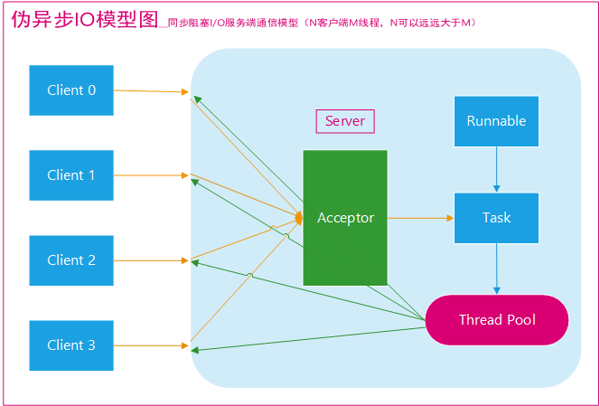

# 1、IO总结
<p style="text-indent:2em">在Java中，主要有三种IO模型，分别是阻塞IO(BIO)、非阻塞IO(NIO)和 异步IO(AIO)，Java提供的IO有关的API，在文件处理的时候，其实依赖操作系统层面的IO操作实现的。比如在Linux 2.6以后，Java中NIO和AIO都是通过epoll来实现的，而在Windows上，AIO是通过IOCP来实现的。</p>  

**Linux的五种IO模型**

**1.阻塞IO模型**  
<p style="text-indent:2em">一般表现为进程或线程等待某个条件，如果条件不满足，则一直等下去。应用进程通过系统调用 recvfrom 接收数据，但由于内核还未准备好数据报，应用进程就会阻塞住，直到内核准备好数据报，recvfrom 完成数据报复制工作，应用进程才能结束阻塞状态。</p>

**2.非阻塞IO模型**  
<p style="text-indent:2em">应用进程与内核交互，目的未达到之前，不再一味的等着，而是直接返回。然后通过轮询的方式，不停的去问内核数据准备有没有准备好。如果某一次轮询发现数据已经准备好了，那就把数据拷贝到用户空间中。</p>
<p style="text-indent:2em">应用进程通过 recvfrom 调用不停的去和内核交互，直到内核准备好数据。如果没有准备好，内核会返回error，应用进程在得到error后，过一段时间再发送recvfrom请求。在两次发送请求的时间段，进程可以先做别的事情。</p>

**3.IO复用模型**  
<p style="text-indent:2em">应用进程在读取文件时通知内核，如果某个 socket 的某个事件发生时，请向我发一个信号。在收到信号后，信号对应的处理函数会进行后续处理。</p><p style="text-indent:2em">应用进程预先向内核注册一个信号处理函数，然后用户进程返回，并且不阻塞，当内核数据准备就绪时会发送一个信号给进程，用户进程便在信号处理函数中开始把数据拷贝的用户空间中。</p>

**4.信号驱动IO模型**  
<p style="text-indent:2em">多个进程的IO可以注册到同一个管道上，这个管道会统一和内核进行交互。当管道中的某一个请求需要的数据准备好之后，进程再把对应的数据拷贝到用户空间中。</p>
<p style="text-indent:2em">IO多路转接是多了一个select函数，多个进程的IO可以注册到同一个select上，当用户进程调用该select，select会监听所有注册好的IO，如果所有被监听的IO需要的数据都没有准备好时，select调用进程会阻塞。当任意一个IO所需的数据准备好之后，select调用就会返回，然后进程在通过recvfrom来进行数据拷贝。</p>
<p style="text-indent:2em">这里的IO复用模型，并没有向内核注册信号处理函数，所以，他并不是非阻塞的。进程在发出select后，要等到select监听的所有IO操作中至少有一个需要的数据准备好，才会有返回，并且也需要再次发送请求去进行文件的拷贝。</p>

**5.异步IO模型**  
<p style="text-indent:2em">应用进程把IO请求传给内核后，完全由内核去操作文件拷贝。内核完成相关操作后，会发信号告诉应用进程本次IO已经完成。</p>
<p style="text-indent:2em">用户进程发起aio_read操作之后，给内核传递描述符、缓冲区指针、缓冲区大小等，告诉内核当整个操作完成时，如何通知进程，然后就立刻去做其他事情了。当内核收到aio_read后，会立刻返回，然后内核开始等待数据准备，数据准备好以后，直接把数据拷贝到用户控件，然后再通知进程本次IO已经完成。</p>

<p><b>总结：</b>前四种IO模型均为同步IO(区别在第一阶段处理不同，第二阶段处理相同，均阻塞于recvfrom调用)，最后一种属于异步IO(将两个阶段的操作封装在一起)</p>

**同步与异步**  
- <b>同步：</b> 同步就是发起一个调用后，被调用者未处理完请求之前，调用不返回。
- <b>异步：</b> 异步就是发起一个调用后，立刻得到被调用者的回应表示已接收到请求，但是被调用者并没有返回结果，此时我们可以处理其他的请求，被调用者通常依靠事件，回调等机制来通知调用者其返回结果。
  
**阻塞和非阻塞**  
- <b>阻塞：</b> 阻塞就是发起一个请求，调用者一直等待请求结果返回，也就是当前线程会被挂起，无法从事其他任务，只有当条件就绪才能继续。
- <b>非阻塞：</b> 非阻塞就是发起一个请求，调用者不用一直等着结果返回，可以先去干其他事情。

# 2、常见IO通信模型JAVA代码实现
1.BIO(Blocking I/O)


<b>伪异步IO</b>



`BIOServer.java`

```java
import java.io.*;
import java.net.ServerSocket;
import java.net.Socket;
import java.util.concurrent.ExecutorService;
import java.util.concurrent.Executors;

/**
 * 基于BIO的socket通信,服务端
 */
public class BIOServer {
    private final static int BIO_PORT = 8888;
    public static void main(String[] args) {
        ServerSocket serverSocket = null;
        try{
            //线程池
            ExecutorService executor = Executors.newFixedThreadPool(10);
            serverSocket = new ServerSocket(BIO_PORT);
            System.out.println("启动服务器，监听端口"+BIO_PORT);
            while(!Thread.currentThread().isInterrupted()){
                Socket socket = serverSocket.accept();
                System.out.println("客户端[" + socket.getPort() + "]已连接");
                executor.submit(new BIOHandler(socket));
            }

        }catch (Exception e){
            e.printStackTrace();
        }finally {
            if (serverSocket != null){
                try {
                    serverSocket.close();
                    System.out.println("关闭ServerSocket");
                } catch (IOException e) {
                    e.printStackTrace();
                }
            }
        }
    }
}
class BIOHandler implements Runnable{
    private Socket socket;
    private static final  String QUIT = "quit";
    public BIOHandler(Socket socket) {
        this.socket = socket;
    }

    @Override
    public void run() {
        try {
            while (!Thread.currentThread().isInterrupted()&&!socket.isClosed()){
                //创建IO流
                BufferedReader bufferedReader = new BufferedReader(new InputStreamReader(socket.getInputStream()));
                BufferedWriter bufferedWriter = new BufferedWriter(new OutputStreamWriter(socket.getOutputStream()));

                String msg = null;
                while ((msg = bufferedReader.readLine()) != null) {
                    // 读取客户端发送的消息,当对方关闭时返回null
                    System.out.println("客户端["+socket.getPort()+"]："+ msg);
                    //回复客户发送的消息
                    bufferedWriter.write("服务器：" + msg + "\n");
                    bufferedWriter.flush(); //保证缓冲区的数据发送出去
                    //查看客户端是否退出
                    if(QUIT.equals(msg)){
                        System.out.println("客户端["+socket.getPort()+"]已退出");
                        break;
                    }
                }
            }
        } catch (IOException e) {
            e.printStackTrace();
        }
    }
}

```

`BIOClient.java`

```java
package com.lee.quartz.socket;

import java.io.*;
import java.net.Socket;

/**
 * 基于BIO的socket通信,客户端
 */
public class BIOClient {
    private final static int BIO_PORT = 8888;
    private static final  String QUIT = "quit";
    public static void main(String[] args) {
        Socket socket = null;
        BufferedWriter bufferedWriter = null;
        try {
            // 创建socket
            socket = new Socket("127.0.0.1",BIO_PORT);
            //创建IO流
            BufferedReader bufferedReader = new BufferedReader( new InputStreamReader(socket.getInputStream()));
            bufferedWriter = new BufferedWriter( new OutputStreamWriter(socket.getOutputStream()));
            //等待用户输入信息
            BufferedReader consolReader = new BufferedReader(new InputStreamReader(System.in));
            while (true) {
                String input = consolReader.readLine();
                //发送消息给服务器
                bufferedWriter.write(input + "\n");
                bufferedWriter.flush();
                //读取服务器返回的消息
                String msg = bufferedReader.readLine();
                System.out.println(msg);

                //查看用户是否退出
                if(QUIT.equals(input))break;
            }
        } catch (IOException e) {
            e.printStackTrace();
        }finally {
            if(bufferedWriter != null){
                try {
                    bufferedWriter.close();
                    System.out.println("关闭socket");
                } catch (IOException e) {
                    e.printStackTrace();
                }
            }
        }
    }
}

```

2.NIO(Non-blocking I/O)
基于jdk api实现

基于netty实现

3.AIO(Asynchronous I/O)

# 3、IO流
1.按操作方式分类

2.按操作对象分类


