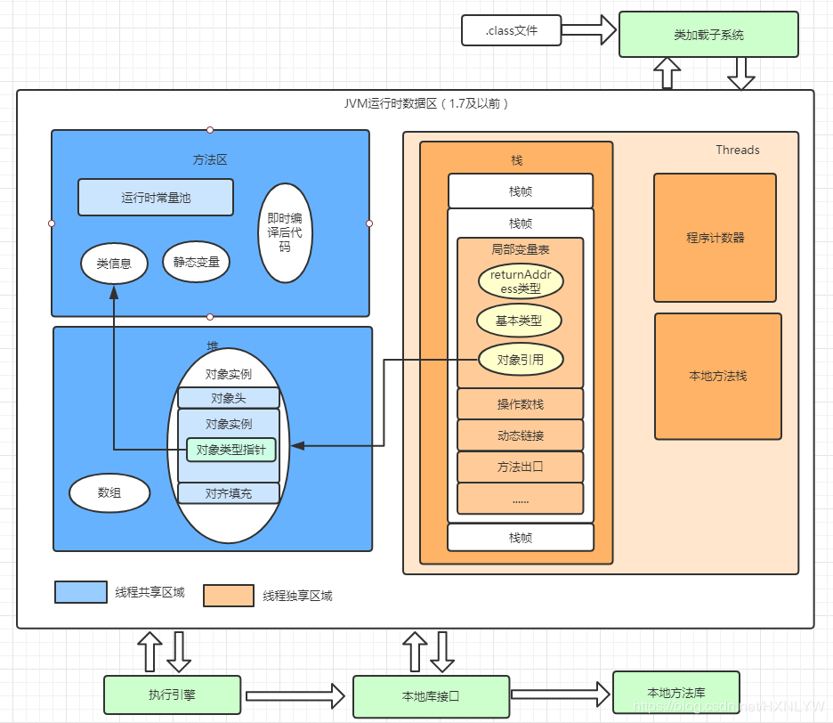
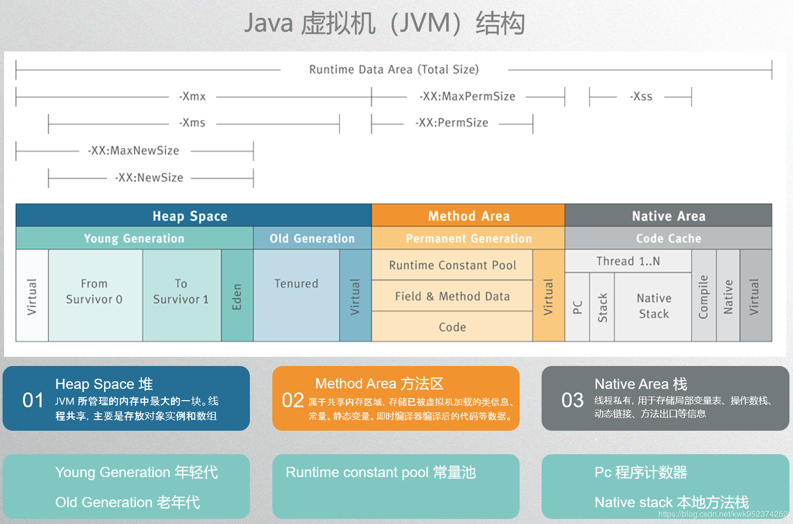

# JVM虚拟机模型
JVM主要由以下部门组成
- 类加载器(ClassLoader)
- 运行时数据区(Runtime Data Area)
- 执行引擎(Execution Engine)
- 本地库接口(Native Interface)



# 1、类加载机制
- JVM虚拟机启动时根据内存配置要求，为JVM申请特定大小的内存空间(JVM内存按照功能划分，可以粗略地划分为方法区(Method Area) 
和堆(Heap),而所有的类的定义信息都会被加载到方法区中。)
- 内存空间申请好后，JVM会创建一个使用C++语言实现的引导类加载器(Bootstrap Classloader)实例，负责加载JVM虚拟机运行时所需的系统级别的基本类，即{JRE_HOME}/lib目录下的jar包和配置到内存。
- 创建JVM启动器实例Launcher,并获取类加载器。
    - Launcher的内部，其定义了两个类加载器(ClassLoader),分别是拓展类加载器(ExtClassLoader) 和 应用类加载器(AppClassLoader)。
    - ExtClassLoader和AppClassLoader均继承自共同的父类(抽象类ClassLoader的子类)URLClassLoader,从ClassLoader的源码可以看出，双亲委派模型的具体实现
    - 方法执行完毕后，JVM销毁，释放内存
```java
    /**
     * loadClass(String, boolean) method.  It is invoked by the Java virtual machine to resolve class references. 
     */
    public Class<?> loadClass(String name) throws ClassNotFoundException {
        return loadClass(name, false);
    }

    protected Class<?> loadClass(String name, boolean resolve) throws ClassNotFoundException {
        synchronized (getClassLoadingLock(name)) {
            // 首先，检查是否已经被当前的类加载器记载过了，如果已经被加载，直接返回对应的Class<T>实例
            Class<?> c = findLoadedClass(name);
            if (c == null) {
                long t0 = System.nanoTime();
                try {
                    if (parent != null) {
                        //如果有父类加载器，则先让父类加载器加载
                        c = parent.loadClass(name, false);
                    } else {
                        // 没有父加载器，则查看是否已经被引导类加载器加载，有则直接返回
                        c = findBootstrapClassOrNull(name);
                    }
                } catch (ClassNotFoundException e) {
                    // ClassNotFoundException thrown if class not found
                    // from the non-null parent class loader
                }
                // 父加载器加载失败，并且没有被引导类加载器加载，则尝试该类加载器自己尝试加载
                if (c == null) {
                    // 尝试自己加载
                    long t1 = System.nanoTime();
                    c = findClass(name);

                    // this is the defining class loader; record the stats
                    sun.misc.PerfCounter.getParentDelegationTime().addTime(t1 - t0);
                    sun.misc.PerfCounter.getFindClassTime().addElapsedTimeFrom(t1);
                    sun.misc.PerfCounter.getFindClasses().increment();
                }
            }
            if (resolve) {
                resolveClass(c);
            }
            return c;
        }
    }
```
# 2、双亲委派模型
- 委托父类加载器ExtClassLoader帮忙加载({JRE_HOME}/lib/ext/目录下)；
- 父类加载器ExtClassLoader加载不了，则查询引导类加载器Bootstrap Class Loader有没有加载过该类；
- 如果引导类加载器Bootstrap Class Loader没有加载过该类，则当前的类加载器AppClassLoader应该自己加载该类；
- 若加载成功，返回 对应的Class<T> 对象；若失败，抛出异常“ClassNotFoundException”。

# 3、运行时数据区
- 1、程序计数器：可以看做是当前线程所执行的字节码的行号指示器。占用内存小，多线程间互不影响私有内存。
- 2、java虚拟机栈：每个方法在执行的同时都会创建一个栈帧(Stack  Frame)用于存储局部变量表、操作数栈、动态链接、方法出口等信息,它也是线程私有的，生命周期与线程相同。如果线程请求的栈的深度大于虚拟机所允许的深度，将抛出 StackOverflowError 异常；如果扩展时无法申请到足够的内存，就会抛出 OutOfMemoryError 异常。
    - 栈中存的是基本数据类型和堆中对象的引用。一个对象的大小是不可估计的，或者说是可以动态变化的，但是在栈中，一个对象只对应了一个 4btye 的引用
- 3、本地方法栈：与虚拟机栈所发挥的作用是非常相似，区别只不过是虚拟机栈为虚拟机执行Java方法（也就是字节码）服务，而本地方法栈则为虚拟机使用到的 Native 方法服务，也是线程私有的。与Java虚拟机栈一样，本地方法栈也会抛出StackOverflowError和 OutOfMemoryError 异常。
- 4、方法区：
  - 是各个线程共享的内存区域，它用于存储已被虚拟机加载的类信息、常量、静态变量、即时编译器编译后的代码等数据。
  - 这个区域的内存回收目标主要是针对常量池的回收和对类型的卸载。还可以选择不实现垃圾收集。
  - 当方法区无法满足内存分配需求时，将抛出OutOfMemoryError异常。
  - 运行时常量池：Class 文件中除了有类的版本、字段、方法、接口等描述信息外，还有一些信息是常量池，用于存放编译期生成的各种字面量和符号引用，这部分内容将在类加载后进入方法区的运行时常量池中存放。
  - 直接内存:直接内存的分配不会受到 Java 堆大小的限制，但是，既然是内存，肯定还是会受到本机总内存大小以及处理器寻址空间的限制。如果各个内存区域总和大于物理内存限制，从而导致动态扩展时出现 OutOfMemoryError 异常。
- 5、java堆：
  - 是被所有线程所共享的一块内存区域，在虚拟机启动时创建。此内存区域的唯一目的就是：存放对象实例，几乎所有的对象实例都在这里分配内存。
  - 堆是垃圾收集器管理的主要区域.
  - 年轻代：一般占据堆的 1/3 空间
    - Eden区:From区:To区(默认8:1:1)
    - Eden区：Java 新对象的出生地（如果新创建的对象占用内存很大，则直接分配到老年代，如：大的数组）。当Eden区内存不够的时候就会触发 MinorGC，对新生代区进行一次垃圾回收。
    - ServivorFrom：上一次 GC 的幸存者，作为这一次 GC 的被扫描者。
    - ServivorTo：保留了一次 MinorGC 过程中的幸存者。
    - MinorGC的过程（复制->清空->互换）
      - 首先，把 Eden 和 ServivorFrom 区域中存活的对象复制到 ServicorTo 区域（如果有对象的年龄以及达到了老年的标准，则赋值到老年代区），同时把这些对象的年龄+1（如果 ServicorTo 不够位置了就放到老年区）；
      - 然后,清空 Eden 和 ServicorFrom 中的对象；
      - 最后，ServicorTo 和 ServicorFrom 互换，原 ServicorTo 成为下一次 GC 时的 ServicorFrom区。
  - 老年代：对象进入老年代的4种情况
    - 进行Minor GC时发现，存活的对象在ToSpace区中存不下，那么把存活的对象存入老年代。
    - 大对象直接进入老年代。对象大小超过PretenureSizeThreshold这个参数设置的值(默认3M)时，即使Eden区有足够的空间来存放，也不会存放在Eden区，而是直接存入老年代。
    - 长期存活的对象将进入老年代。对象每"熬过"一次Minor GC(没有被回收，也没有因为To区没有空间而被移动到老年代中)，年龄就增加一岁，当它的年龄增加到一定程度(默认15岁，配置参数-XX:MaxTenuringThreshold)，就会被晋升到老年代中
    - 动态对象年龄判定。如果在From空间中，相同年龄所有对象的大小总和大于From和To空间总和的一半，那么年龄大于等于该年龄的对象就会被移动到老年代，而不用等到15岁(默认)
  - Eden区空间不足,触发MinorGC;老年代空间不足,触发Full GC。
# 4、JVM常用参数

- Xss：每个线程的栈大小
- Xms：堆空间的初始值
- Xmx：堆空间最大值、默认为物理内存的1/4，一般Xms与Xmx最好一样
- Xmn：年轻代的大小
- XX:NewRatio ：新生代和年老代的比例
- XX:SurvivorRatio ：eden区和幸存区的占用比例
- XX:PermSize：设定内存的永久保存区域（1.8已废除）
- XX:MetaspaceSize：1.8使用此参数替代上述参数
- XX:MaxPermSize：设定最大内存的永久保存区域（1.8已废除）
# 5、 Java 中引用
- 强引用:类似 Object obj = new Object() 这类引用，只要强引用还存在，垃圾收集器永远不会回收掉被引用的对象。
- 软引用:用来描述一些还有用但并非必须的对象。对于软引用关联着的对象，在系统将要发生内存溢出异常之前，将会把这些对象列进回收范围之中进行第二次回收。
- 弱引用:也是用来描述非必需对象的，但是它的强度比软引用更弱一些，被弱引用关联的对象只能生存到下一次垃圾收集发生之前。当垃圾收集器工作时，无论当前内存是否足够，都会回收掉只被弱引用关联的对象。
- 虚引用:也叫幽灵引用或幻影引用，是最弱的一种引用关系。一个对象是否有虚引用的存在，完全不会对其生存时间构成影响，也无法通过虚引用来取得一个对象实例。它的作用是能在这个对象被收集器回收时收到一个系统通知。
- 内存泄露的根本原因:
长生命周期的对象持有短生命周期对象的引用就很可能发生内存泄漏，尽管短生命周期对象已经不再需要，但是因为长生命周期持有它的引用而导致不能被回收，这就是 Java 中内存泄漏的发生场景。


[参考链接](https://mp.weixin.qq.com/s/ksRa2rQYrCnjzrKVBbLSxQ)   