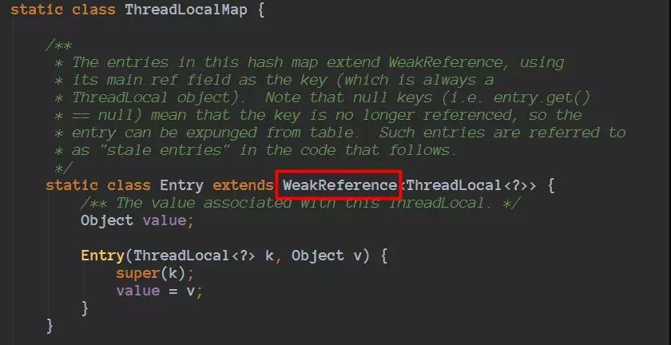
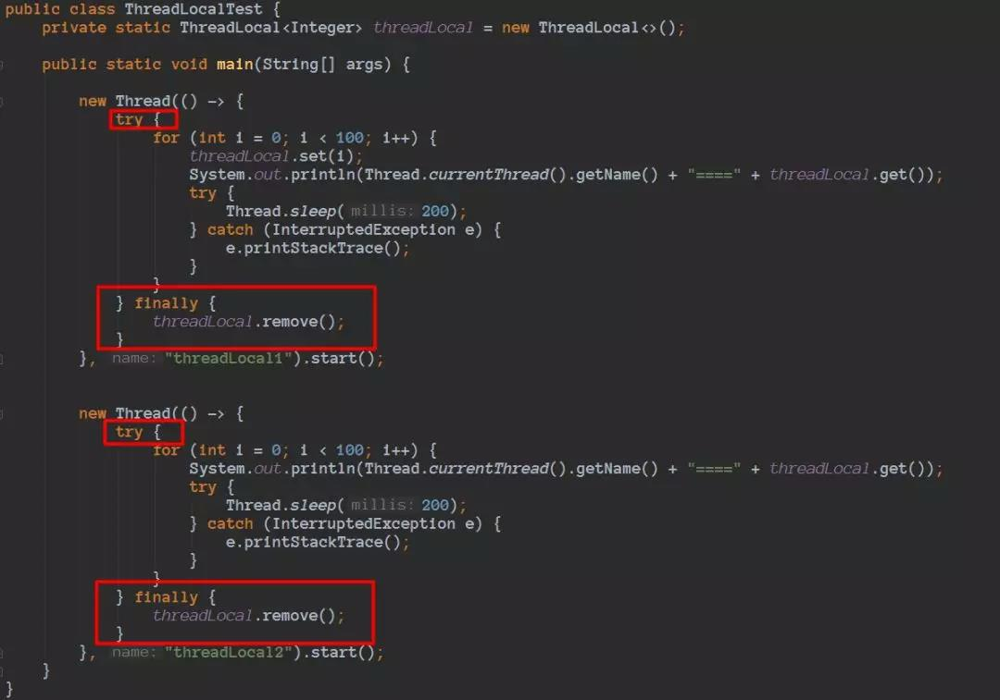

# 多线程拾遗
## 1、常用关键字
- synchronized:可以保证方法或者代码块在运行时，同一时刻只有一个进程可以访问，同时它还可以保证共享变量的内存可见性。
    - 普通同步方法，锁是当前实例对象
    - 静态同步方法，锁是当前类的 class 对象
    - 同步方法块，锁是括号里面的对象
        - 同步代码块：monitorenter 指令插入到同步代码块的开始位置，monitorexit指令插入到同步代码块的结束位置，JVM 需要保证每一个monitorenter都有一个monitorexit与之相对应。任何对象都有一个 Monitor 与之相关联，当且一个 Monitor 被持有之后，他将处于锁定状态。线程执行到monitorenter 指令时，将会尝试获取对象所对应的 Monitor 所有权，即尝试获取对象的锁
        - 同步方法：synchronized 方法则会被翻译成普通的方法调用和返回指令如：invokevirtual、areturn指令，在 VM 字节码层面并没有任何特别的指令来实现被synchronized修饰的方法，而是在 Class 文件的方法表中将该方法的access_flags字段中的synchronized 标志位置设置为 1，表示该方法是同步方法，并使用调用该方法的对象或该方法所属的 Class 在 JVM 的内部对象表示 Klass 作为锁对象。
- volition:当一个共享变量被volatile修饰时，它会保证修改的值会立即被更新到主存，当有其他线程需要读取时，它会去内存中读取新值。
- transient:与多线程无关,主要用来修饰不用序列化的成员属性。

## 2、常用多线程类 
- ThreadLocal:
    - 同一线程在某地方进行设置，在随后的任意地方都可以获取到，从而可以用来保存线程上下文信息。
    - 每个线程有一个自己的ThreadLocalMap,每个线程往ThreadLocal中读写数据是线程隔离，互相之间不会影响的。
    - 使用ThreadLocal时，可能存在内存泄漏的风险，ThreadLocalMap的静态内部类Entry的key指向ThreadLocal弱引用。
    
    弱引用也是用来描述非必需对象的，当JVM进行垃圾回收时，无论内存是否充足，该对象仅仅被弱引用关联，那么就会被回收。
    当仅仅只有ThreadLocalMap中的Entry的key指向ThreadLocal的时候，ThreadLocal会进行回收。
    在ThreadLocalMap里对应的Entry的键值会变成null，但是Entry是强引用，那么Entry里面存储的Object，并没有办法进行回收。
    由于线程的生命周期很长，如果我们往ThreadLocal里面set了很大很大的Object对象，虽然set、get等等方法在特定的条件会调用进行额外的清理，
    但是ThreadLocal被垃圾回收后，在ThreadLocalMap里对应的Entry的键值会变成null，但是后续在也没有操作set、get等方法了。
    所以最佳实践，应该在我们不使用的时候，主动调用remove方法进行清理。
    

- CountDownLatch:就是一个线程等待，直到他所等待的其他线程都执行完成并且调用countDown()方法发出通知后，当前线程才可以继续执行。
- CyclicBarrier:所有线程都进行等待，直到所有线程都准备好进入await()方法之后，所有线程同时开始执行！
- ConcurrentHashMap:将整个Map分为N个segment(类似HashTable)，可以提供相同的线程安全，但是效率提升N倍，默认N为16。
- CopyOnWriteArrayList:类的所有可变操作（add，set 等等）都是通过创建底层数组的新副本来实现的。当 List 需要被修改的时候，我们并不需要修改原有内容，而是对原有数据进行一次复制，将修改的内容写入副本。写完之后，再将修改完的副本替换原来的数据，这样就可以保证写操作不会影响读操作了
    - 读取操作没有任何同步控制和锁操作，理由就是内部数组 array 不会发生修改，只会被另外一个 array 替换，因此可以保证数据安全。
    - 写入操作 add() 方法在添加集合的时候加了锁，保证了同步，避免了多线程写的时候会 copy 出多个副本出来。
- ReentrantLock:可重入锁，是一种递归无阻塞的同步机制。它可以等同于 synchronized的使用，但是 ReentrantLock 提供了比synchronized 更强大、灵活的锁机制，可以减少死锁发生的概率。

[参考：Java 并发多线程高频面试题](https://mp.weixin.qq.com/s/ftXU2VXUiD__eH3OsWfM3A)
