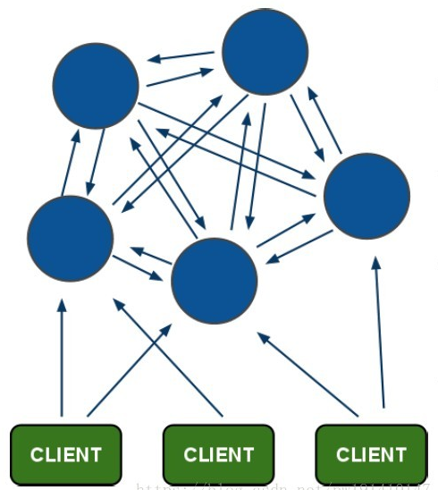

# Redis知识点整理
## 1、持久化机制
- `RDB`方式：定期将内存中的数据以快照的形式保存到硬盘的二进制文件中
- `AOF`方式：将每一个收到的命令都追加到文件最后，类似于MySQL的binlog,重启时会通过执行文件中保存的写命令在内存中重建整个数据库内容。

两种方式同时开启时，数据恢复会优先选择AOF恢复

## 2、单线程的Redis为什么快

- 纯内存操作
- 单线程，避免了频繁的上下文切换
- 采用了非阻塞I/O的多路复用机制
  
## 3、内存淘汰策略
- `noeviction` (默认策略)：对写请求不再提供服务，直接返回错误(DEL请求和部分特殊请求除外)
- `allkeys-lru` ：从所有key中使用LRU算法进行淘汰
- `volatile-lru` ：从设置了过期时间的key中使用LRU算法进行淘汰
- `allkeys-random` ：从所有key中随机淘汰数据
- `volatile-random` ：从设置了过期时间的key中随机淘汰
- `volatile-ttl` ：在设置了过期时间的key中，根据key的过期时间进行淘汰，越早过期的越优先被淘汰

LRU(Least Recently Used)，即最近最少使用。

### 配置内存淘汰策略
- 1.修改redis.conf文件
```
//设置Redis最大占用内存大小为100M
maxmemory 100mb
//设置内存淘汰策略
maxmemory-policy allkeys-lru
```
- 2.通过命令行直接查看/修改
```
//获取Redis最大占用内存
127.0.0.1:6379> config get maxmemory
//设置Redis最大占用内存
127.0.0.1:6379> config set maxmemory 100mb
//获取Redis内存淘汰策略
127.0.0.1:6379> config get maxmemory-policy
//设置Redis内存淘汰策略
127.0.0.1:6379> config set maxmemory-policy allkeys-lru
```

## 4、缓存雪崩，击穿，穿透，预热，降级

- 1.**缓存雪崩:** 缓存同一时间大面积失效，导致的大量请求落到数据库上，造成数据库短时间内承受大量的请求而崩掉

  **解决方案:**

  + 缓存数据过期时间设置随机，防止同一时间大量数据过期现象发生
  + 并发不是特别多的时候，使用**加锁排队**
  + 给缓存数据增加缓存标记，记录是否失效，失效则更新数据缓存

- 2.**缓存穿透:** 缓存和数据库中都没有数据，导致所有请求都落到数据库上，造成数据库短时间内承受大量请求而崩掉

  **解决方案**

  - 接口层增加校验，如用户鉴权校验，id做基础校验，id<=0的直接拦截
  - 在缓存和数据库中都取不到数据的情况下，可以将key-value对写成key-null，缓存有效时间设置短一点(设置太长会导致正常情况也没法使用)，以此来防止重复id的暴力攻击
  - 采用**布隆过滤**，将所有可能存在的数据哈希到一个足够大的bitmap中，一个一定不存在的数据会被这个bitmap拦截掉

- 3.**缓存击穿:** 缓存中没有，但数据库中有（缓存到期），由于并发用户特别多，同时读取缓存没读到数据，又同时去数据库取数据，造成的数据库压力瞬间增大。和缓存雪崩不同的是，缓存击穿指并发查同一条数据，缓存雪崩是不同数据同时过期了，缓存查不到，而去查数据库。

  **解决方案**

  - 设置热点数据用不过期
  - 加**互斥锁**

- 4.**缓存预热:** 系统上线后,将相关的缓存数据直接家在到缓存系统，避免用户在请求是先查数据库，在缓存到缓存

  **解决方案**

  - 直接写个缓存刷新页面，上线后手工操作一下
  - 数据量不大的情况下，可以再项目启动时自动进行加载
  - 定时刷新缓存

- 5.**缓存降级:** 在不影响核心服务和核心流程性能的同时，对不重要的缓存数据才去服务降级策略，例如：Redis出现问题时，不去数据库查询，直接返回默认值给用户。最终目的，为了防止Redis服务故障，导致的数据库跟着发生雪崩

##  5、Redis集群
### 集群模式

#### 1.主从同步/复制

Redis 提供了复制（replication）功能，可以实现当一台数据库中的数据更新后，自动将更新的数据同步到其他数据库上。
在复制的概念中，数据库分为两类，一类是主数据库（master），另一类是从数据库(slave）。主数据库可以进行读写操作，当写操作导致数据变化时会自动将数据同步给从数据库。而从数据库一般是只读的，并接受主数据库同步过来的数据。一个主数据库可以拥有多个从数据库，而一个从数据库只能拥有一个主数据库。
主数据库不用配置，从数据库的配置文件（redis.conf）中可以加载主数据库的信息，也可以在启动时，使用 redis-server --port 6380 --slaveof 127.0.0.1 6379 命令指明主数据库的 IP 和端口。

**优点：**

- 支持主从复制，主机会自动将数据同步到从机，可以进行读写分离；
- 为了分载Master的读操作压力，Slave服务器可以为客户端提供只读操作的服务，写服务仍然必须由Master来完成；
- Slave同样可以接受其它Slaves的连接和同步请求，这样可以有效的分载Master的同步压力；
- Master Server是以非阻塞的方式为Slaves提供服务。所以在Master-Slave同步期间，客户端仍然可以提交查询或修改请求；
- Slave Server同样是以非阻塞的方式完成数据同步。在同步期间，如果有客户端提交查询请求，Redis则返回同步之前的数据；
- 
**缺点：**

- Redis不具备自动容错和恢复功能，主机从机的宕机都会导致前端部分读写请求失败，需要等待机器重启或者手动切换前端的IP才能恢复；
- 主机宕机，宕机前有部分数据未能及时同步到从机，切换IP后还会引入数据不一致的问题，降低了系统的可用性；
- 如果多个Slave断线了，需要重启的时候，尽量不要在同一时间段进行重启。因为只要Slave启动，就会发送sync请求和主机全量同步，当多个 Slave 重启的时候，可能会导致 Master IO剧增从而宕机。
- Redis较难支持在线扩容，在集群容量达到上限时在线扩容会变得很复杂；

#### 2.哨兵模式

**哨兵**是一个独立的进程，作为进程，它会独立运行。其原理是哨兵通过发送命令，等待Redis服务器响应，从而监控运行的多个Redis实例。

**作用：**

通过发送命令，让Redis服务器返回监控其运行状态，包括主服务器和从服务器；
当哨兵监测到master宕机，会自动将slave切换成master，然后通过发布订阅模式通知其他的从服务器，修改配置文件，让它们切换主机；

**故障切换的过程：**

　　假设主服务器宕机，哨兵1先检测到这个结果，系统并不会马上进行 failover 过程，仅仅是哨兵1主观的认为主服务器不可用，这个现象成为`主观下线`。当后面的哨兵也检测到主服务器不可用，并且数量达到一定值时，那么哨兵之间就会进行一次投票，投票的结果由一个哨兵发起，进行 failover 操作。切换成功后，就会通过发布订阅模式，让各个哨兵把自己监控的从服务器实现切换主机，这个过程称为`客观下线`。这样对于客户端而言，一切都是透明的。

**主从服务器配置**
```
# 使得Redis服务器可以跨网络访问
bind 0.0.0.0

# 设置密码
requirepass "123456"

# 以下有关slaveof的配置只是配置从服务器，主服务器不需要配置
# 指定主服务器
slaveof 192.168.11.128 6379
# 主服务器密码
masterauth 123456
```
**哨兵配置**(Redis安装目录下有一个sentinel.conf文件)
```
# 禁止保护模式
protected-mode no
# 配置监听的主服务器，这里sentinel monitor代表监控，mymaster代表服务器的名称，可以自定义，192.168.11.128代表监控的主服务器，6379代表端口，2代表只有两个或两个以上的哨兵认为主服务器不可用的时候，才会进行failover操作。
sentinel monitor mymaster 192.168.11.128 6379 2
# sentinel author-pass定义服务的密码，mymaster是服务名称，123456是Redis服务器密码
# sentinel auth-pass <master-name> <password>
sentinel auth-pass mymaster 123456
```
**优点：**

- 哨兵模式是基于主从模式的，所有主从的优点，哨兵模式都具有。
- 主从可以自动切换，系统更健壮，可用性更高。

**缺点：**

- Redis较难支持在线扩容，在集群容量达到上限时在线扩容会变得很复杂。

#### 3.Cluster 集群


Redis 集群会将用户数据分散保存到各个节点中，集群引入了哈希槽slot,搭建完成后会生成16384个哈希槽slot,同时会根据节点数量大致均等的将16384个哈希槽映射到不同的节点上。当用户存储key-value时，集群会先对key进行CRC16校验，然后对16384取模来决定key-value存储在哪个槽。
Redis是一个网状结构，每个节点都通过TCP连接跟其他每个节点连接，Redis客户端可以直接连接任何一个节点获取集群中的键值对，不需要中间代理，如果该节点不存在用户指定的键值，其内部会自动把客户端重定向到键值所在的节点。

Redis Cluster 支持主从复制和故障恢复。集群使用主从复制模型，每个主节点应至少有一个从节点。某个主节点故障时，所有子节点会广播一个数据包给集群中其他主节点来请求选票，收到大多数主节点回应的节点将赢得选举被选为主节点。

Redis集群至少需要3个主节点，二每个主节点至少有1个从节点，一个集群至少包含6个节点，3主3从。

**集群相关配置**
```
#开启redis的集群模式
cluster-enabled yes

#配置集群模式下的配置文件
cluster-config-file nodes-6379.conf

#集群内节点之间支持最长响应时间
cluster-node-timeout 15000
```
