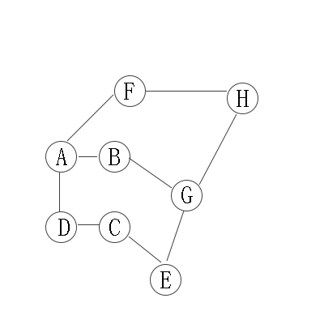
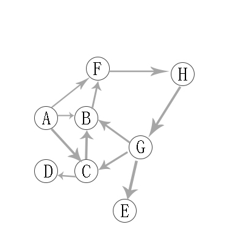
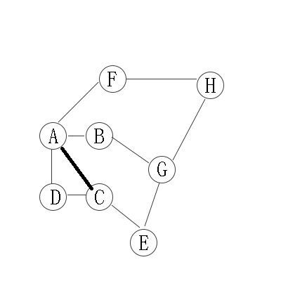
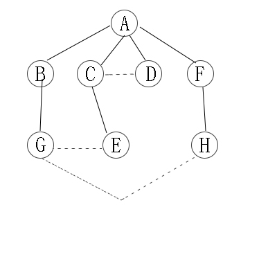
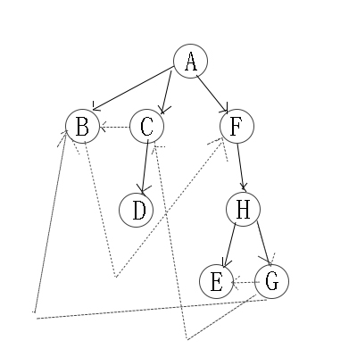

# 图的遍历
**深度优先遍历**  

1、首先以一个未被访问过的顶点作为起始顶点，沿当前顶点的边走到未访问过的顶点；
2、当没有未访问过的顶点时，则回到上一个顶点，继续试探别的顶点，直至所有的顶点都被访问过。

- 无向图遍历图解  
  
  

访问顺序是：A -> B -> G -> E -> C -> D -> H -> F

- 有向图遍历图解  
  
  

访问顺序是：A -> B -> F -> H -> G -> C -> D -> E

**广度优先遍历**  

类似于树的层序遍历。
- 无向图遍历图解  

<table>
    <tr>
        <td></td>
        <td></td>
    </tr>
</table>  

访问顺序是：A -> B -> C -> D -> F -> G -> E -> H

- 有向图遍历图解

<table>
    <tr>
        <td></td>
        <td></td>
    </tr>
</table>

访问顺序是：A -> B -> C -> F -> D -> H -> E -> G