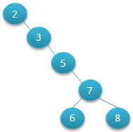
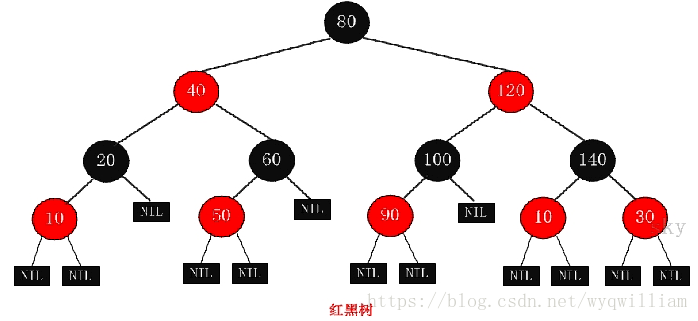

# 常见树总结  

**1.二叉树**

二叉树是每个节点最多有两个子树的树结构，通常子树被称作“左子树”和“右子树”。特点：左子树的键值小于根的键值，柚子树的键值大于根的键值。
<table>
	<tr>
        <td></td>
        <td></td>
    </tr>
</table>

二叉树一般有三种遍历方式：前序遍历、中序遍历、后续遍历。
- 前序遍历：首先访问根节点，然后遍历左子树，最后遍历右子树。
- 中序遍历：是先遍历左子树，然后访问根节点，然后遍历右子树。
- 后序遍历：是先遍历左子树，然后遍历右子树，最后访问树的根节点。
**2.平衡二叉树(AVL树)**
再符合二叉树的条件下，他的任何节点的连个字数高度最大差必须为1。下图左边树AVL树，他的任何节点的两个字数高度差<=1；右边的不是AVL树，气根节点的左子树高度为3，右子树高度为1.

在对AVL树进行插入或者删除的时候会出现不平衡的情况，这时候就需要使用旋转的方式来让它继续保持平衡。

**3.红黑树**
它一种平衡二叉树。红黑树的每个节点上都有存储位表示节点的颜色，可以是红(Red)或黑(Black)。
红黑树的特性:
（1）每个节点或者是黑色，或者是红色。
（2）根节点是黑色。
（3）每个叶子节点（NIL）是黑色。 [注意：这里叶子节点，是指为空(NIL或NULL)的叶子节点！]
（4）如果一个节点是红色的，则它的子节点必须是黑色的。
（5）从一个节点到该节点的子孙节点的所有路径上包含相同数目的黑节点。

**4.B-树(B树)**

B-树(B树)是一种多路搜索树（并不一定是二叉的）
B-树的特性：
1.关键字集合分布在整颗树中；
2.任何一个关键字出现且只出现在一个结点中；
3.搜索有可能在非叶子结点结束；
4.其搜索性能等价于在关键字全集内做一次二分查找；
5.自动层次控制；
如下图是3阶B树

**5.B+树**
B+ 树是一种树数据结构，是一个n叉树，每个节点通常有多个孩子，一棵B+树包含根节点、内部节点和叶子节点。根节点可能是一个叶子节点，也可能是一个包含两个或两个以上孩子节点的节点。通常用于数据库和操作系统的文件系统中，作为元数据索引。特点是能够保持数据稳定有序，其插入与修改拥有较稳定的对数时间复杂度。B+ 树元素自底向上插入。
B+的特性：
1.所有关键字都出现在叶子结点的链表中（稠密索引），且链表中的关键字恰好是有序的；
2.不可能在非叶子结点命中；
3.非叶子结点相当于是叶子结点的索引（稀疏索引），叶子结点相当于是存储（关键字）数据的数据层；
4.更适合文件索引系统；

**6.B*树**  

在B+树的非根和非叶子结点再增加指向兄弟的指针；B*树定义了非叶子结点关键字个数至少为(2/3)*M，即块的最低使用率为2/3(代替B+树的1/2)。

